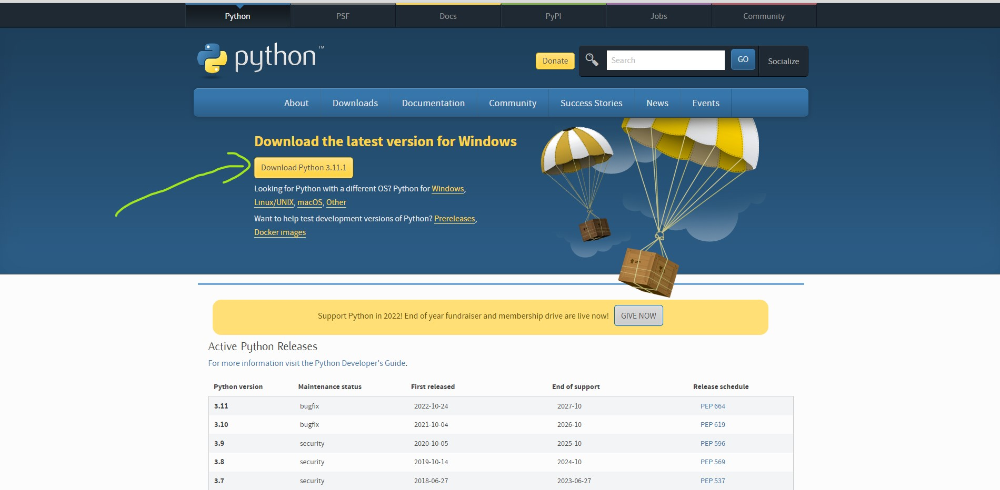
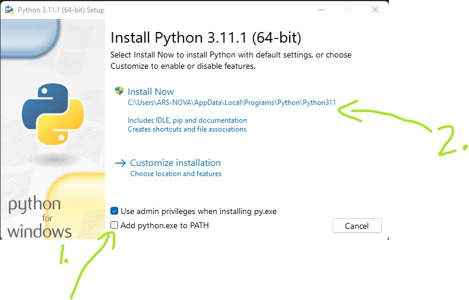
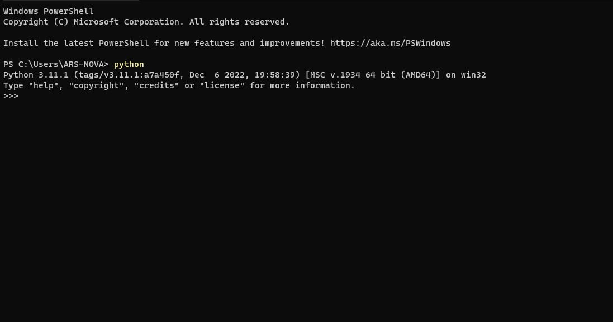
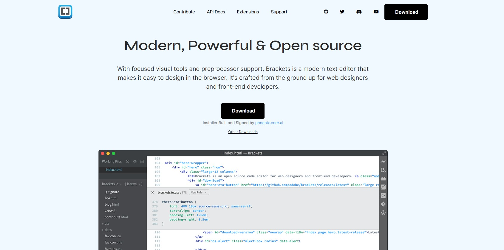
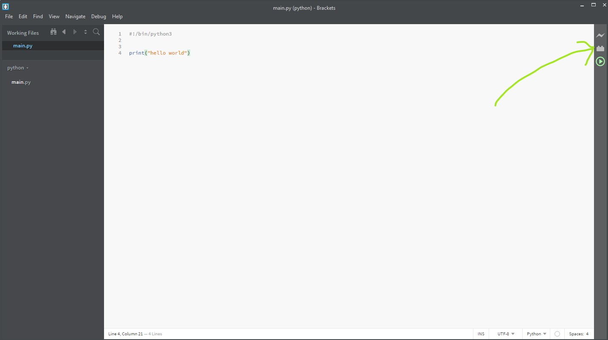
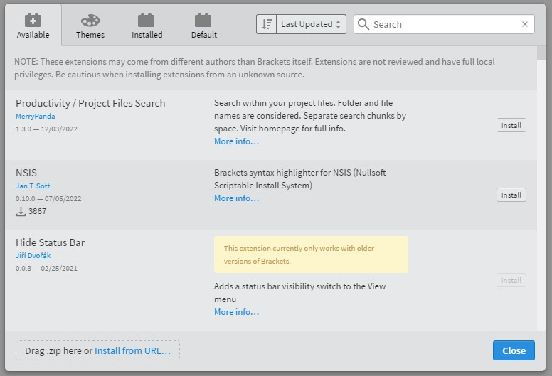
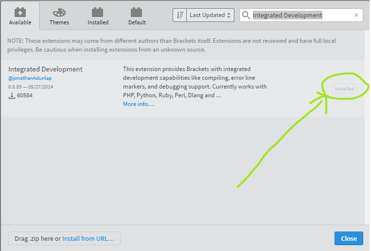

# Listen 1 Notes

##  Download python
1. got to `https://www.python.org/downloads/` to download python 3.11.1
2. click `Download Python 3.11.1` to download the file

3. save the download the file to your download folder  
If you are not able to find your downlaoded file press `Ctrl + J` on while your browser is open the very first item should be it


## Install python 
1. double click on the file named `python-3.11.1-amd64.exe`
2. to Install 
* 1.  Check Add python.exe to PATH
* 2.  Click install now


* 3. once you see the set up complete screen close it.
* 4. to comformed set up open Terminal or CMD in your windows and type 
```
python
```  
You should see this as output


  
## Download Brackets
1. go to `https://brackets.io/`
2. click the Download button


## Install python extension
1. Start bracket
2. Click the small lego icon on the right

3. A pop up will open looks like this

4. Click the search bar and enter `Integrated Development`
5. Click install button 
